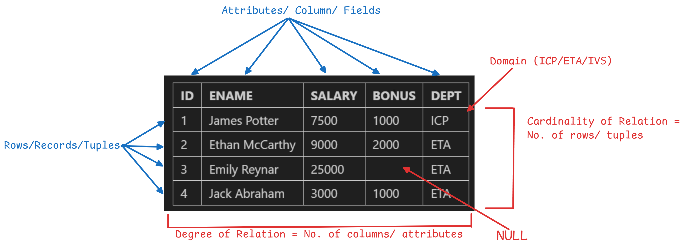
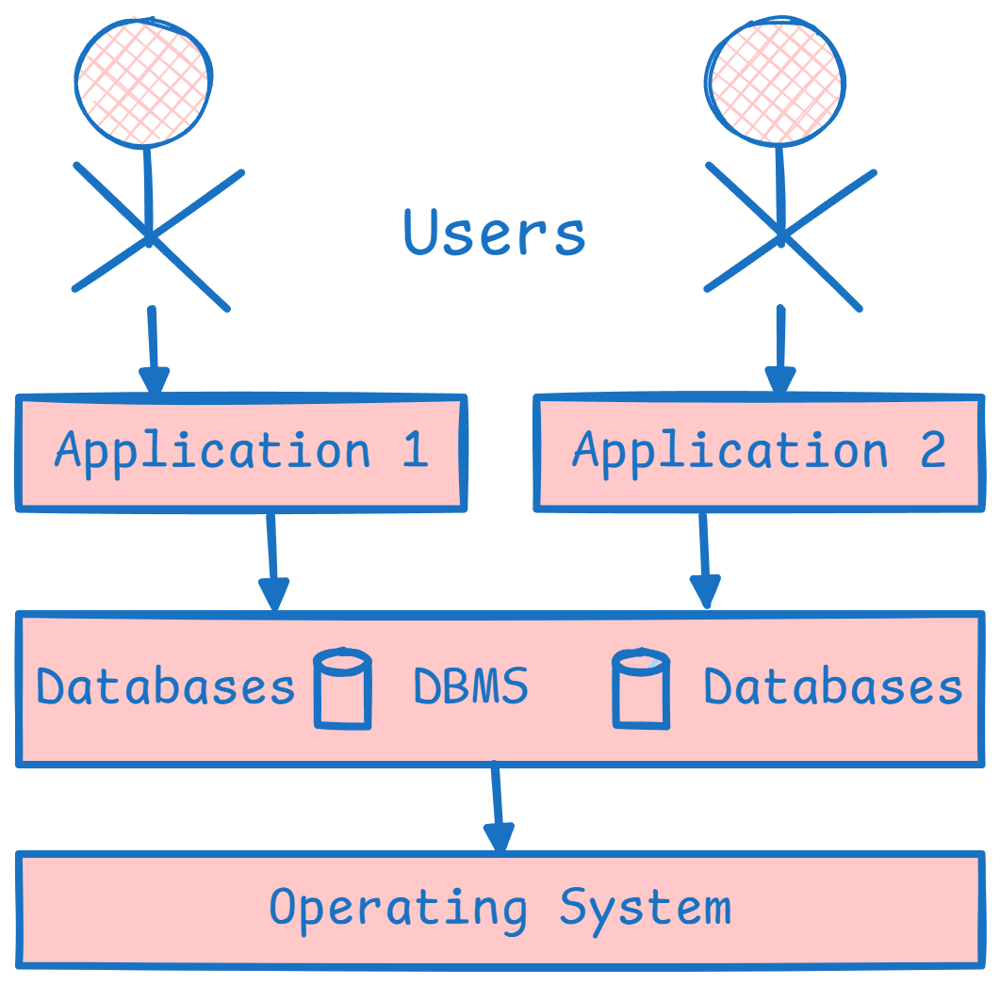
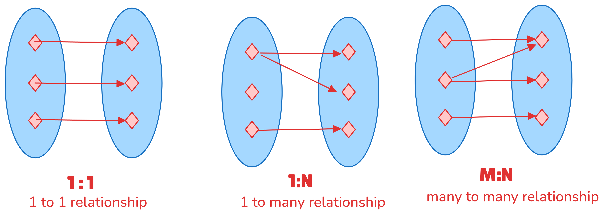

# Databases
A database is a shared collection of logically related data and discription of these data, designed to meet the information needs of an organization. 

> Data is oil & today all business are **data driven**. 

## Uses of database
1. **Data Storage:** Used to store a large amounts of structured data, making it easily accessibl, searchable and retrievable,

2. **Data Analaysis:** A database can be used to perform complext data analysis, generate reports and provide insights into the data.

3. **Record Keeping:** A database is often used to keep track of important records, such as financial transactions, customer information, and inventory levels. 

4. **Web Applications:** Databases are an essential component of many web applications, providing dynamic content and user management. 

### CRUD Operation
- Create
- Retrieve
- Update
- Delete

## Properties of Ideal Database
1. **Integrity** = Accuracy + Consistency. Data should remain correct and unchanged unless intentionally updated through valid processes.

2. **Availablity:** Should have zero downtime; data must be accessible 24×7.

3. **Security**: Protects data from unauthorized access, breaches, or corruption.

4. **Application Independence**: A single database should be usable by multiple applications (e.g., web, Android, macOS) without dependency on any one of them.

5. **Concurrency:**  Supports simultaneous access by multiple users without conflicts or performance degradation.

## Types of Databases

1. **Relational Databases:** 
Also known as SQL databases, these databases uses a relational model to organize data into tables with rows and columns.

2. **NoSQL Databases:** 
These databases are designed to handle large amounts of unstructured or semi-structured data, such as documents, images or videos (MongoDB)

3. **Column Databases:**
These databases stored in columns rather than rows, making them well-suited for data warehousing and analytical applications. (Amazon Redshift, Google BigQuery)

4. **Graph Databases:** These databases are used to store and query graph-structured data, such as social network connections or recommendation system (Neo4, Amazon Neptune)

5. **Key-Value Databases:** 
These databases are store data as a collection of keys and values, making them well-suited for caching and simple data storage needs (Redis and Amazon DynamoDB)

> **Note:** A complex application can have multiple databases running together and powering the application. 

> Each database has its own use case.

# Relational Databases
Also known as SQL databases, these databases use a relational model to organize data into tables with rows and columns. 

$Employee$
|ID|ENAME|SALARY|BONUS|DEPT|
|-|-|-|-|-|
|1|James Potter|7500|1000|ICP|
|2|Ethan McCarthy|9000|2000|ETA|
|3|Emily Reynar|25000||ETA|
|4|Jack Abraham|3000|1000|ETA|

## DBMS
A database management system(DBMS) is a software system that provides the interfaces and tools needed to store, organize, and manage data in a database. A DBMS acts as an intermediary betweeen the database and the applications or users that access the data stored in the database. 

#### Why Operating System layer in DBMS.
- Data is stored in the database at a logical level.
- However, the actual data are stored physically on hardware(e.g., hard drives, SSDs, or RAM)
- The database itself cannot directly interact with hardware; it must communicate through the operating system, which provides system calls and drivers to manage file storage, memory, and I/O operations.

## Function of DBMS

1. **Data Management:** Store, Retrive, and Modify data

2. **Integrity:** Maintain accuracy of data

3. **Concurrency:** Simultaneous data access for multiple users.

4. **Transaction:** Modification to database must either be successful or must not happen at all.

5. **Security:** Access to authorized users only

6. **Utilities:** Data import/export, user management, backup, logging

> We can use MySQL Workbench or Apache XAMPP as DBMS

## Database Keys

Database keys are attributes(columns), or a set of attributes, used to uniquely identify records(tuples/rows) within a table and to define relationships between different tables in a tables. They help to maintain data integrity and avoid duplicates or inconsistent data.

## Types of Database keys

| RollNo | Name         | Branch | Email                                       |
| ------ | ------------ | ------ | ------------------------------------------- |
| 1      | Shivam Sinha | CSE    | [shivam@gmail.com](mailto:shivam@gmail.com) |
| 2      | Ankit Sharma | EEE    | [ankit@gmail.com](mailto:ankit@gmail.com)   |
| 3      | Neha Verma   | ME     | [neha@gmail.com](mailto:neha@gmail.com)     |

### 1. Super Key 
A set of one or more columns that uniquely identifies any row in a RDBMS table called Super Key.

- Here, ``Roll No``, ``Email``, ``RollNo, Name``, ``RollNo, Name, Branch`` etc. that  uniquely identifies rows are all Super key.  

### 2. Candidate Key
A candidate key is a minimal Super Key, meaning is is the smallest set of attributes, that can be used to uniquely identifies a row(tuple) in the table

- Here, ``RollNo`` and ``Email`` are Candidate key

### 3. Primary Key
A primary key is a unique identifier for each tuple in a table. There can only be 1 primary key in a table and it cannot contain null values. 

- Mandatory Requirement for Primray Key
    - No NULL values
    - No Duplicates values

- Good to have requirement for Primary key
    - Numerical values
    - Smallest
    - Constant (No change in future)

- So here we will choose ``RollNo`` as primary key.

### 4. Alternate Key
An alternate key is a candidate key that is not used as the primary key.
$ \text(Candidate Key) - \text(Primary Key) = \text(Alternate Key) $

- Here, ``RollNo`` become primary key, so ``email`` will become alternate key

### 5. Composite Key
A composite key is a primary key that is made up of two or more attributes. Composite keys are used when a single attribute is not sufficie3nt to uniquely identifies a tuple in a table. 

$$ Student Table $$

| Sid | name | email | phone |
|-----|------|-------|-------|
| 0 | 0 | 0 | 0 |

$$ Course Table $$

| Cid | name | price | instructor |
|-----|------|-------|-------|
| 0 | 0 | 0 | 0 |

$$ Enrollement Table $$

| Sid | Cid | Date | Payment |
|-----|------|-------|-------|
| 0 | 0 | 0 | 0 |

> **Note:** Here, no single row will identify the rows of enrollment table. So we combine ``Sid and Cid`` together to make a **composite key.**

### 6. Surrogate Key

| Name | Branch | CGPA |
|------|--------|------|
| 0    |   0    | 0    |

> **Note:** In this table no Super Key is present, no key can uniquely identify the rows(tuple). So we create a extra row to uniquely identify the Table. The new key is called surrogate key. 

| Id | Name | Branch | CGPA |
|----|------|--------|------|
| 0  | 0    |   0    | 0    |

- Here, ``Id`` is surrogate key. 

### 7. Foreign Key
A foreign key is a primary key from one table that is used to establish a relationship with another table. 

- Here, ``Sid and Cid`` are Foreign Key, becuase they reference another table.

> **Note:** A foreign key is important because it maintains **referential integrity**. If a row in the main (parent) table is deleted, the corresponding rows in the related (child) table can also be deleted automatically (depending on the ON DELETE CASCADE rule).

## Cardinality of a Relationship
In database design (especially ER diagrams), cardinality defines the number of instances of one entity that can or must be associated with the number of instances of another entity.
It basically tells us the nature of the relationship between two tables/entities.

### Examples

1. Person -> Driving Licence Number = ``1 to 1`` (For one person there can only be one driving licence number)

2. Student -> College Branch = ``1 to Many`` (One student can enroll in only one college branch)

3. Restraunts -> Orders = ``Many to Many`` (Different restraunts can have same order)

4. Students -> Courses = ``Many to Many`` (Different students can enroll in same course)

## Drawbacks of Databases

1. **Complexity:** Setting up and maintaining a database can be complex and time-consuming, especially for large and complex systems.

2. **Cost:** The cost of setting up and maintaining a database, including hardware, software, and personnel, can be high.

3. **Scalability:** As the amount of data stored in a database grows, it can become more difficult to manage, leading to performance and scalability issues.

4. **Data Integrity:** Ensuring the accuracy and consistency of data stored in a database can be a challenge, especially when multiple users are updating the data simultaneously.

5. **Security:** Securing a database from unauthorized access and protecting sensitive information can be difficult, especially with the increasing threat of cyber attacks.

6. **Data Migration:** Moving data from one database to another or upgrading to a new database can be a complex and time-consuming process.

7. **Flexibility:** The structure of a database is often rigid and inflexible, making it difficult to adapt to changing requirements or to accommodate new types of data.