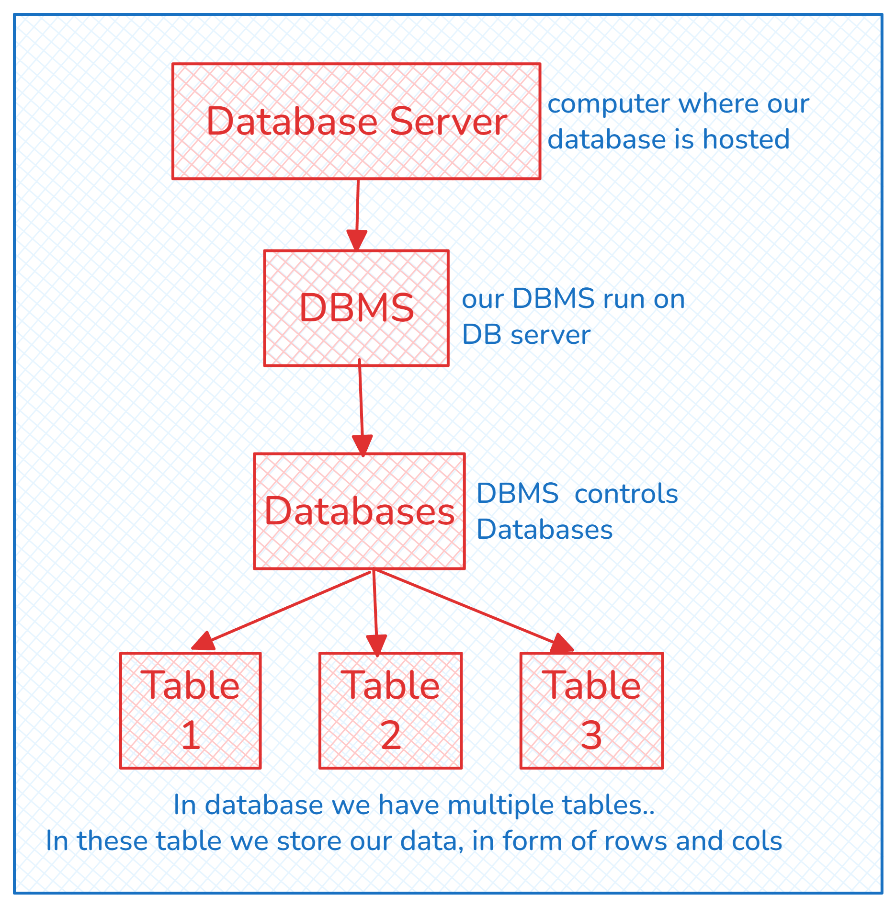

## Relational Database Model



# What is SQL?
SQL (Structured Query Language) is a programming language used for managing
and manipulating data in relational databases. It allows you to insert, update,
retrieve, and delete data in a database. It is widely used for data management in
many applications, websites, and businesses. In simple terms, SQL is used to
communicate with and control databases.


# Types of SQL Commands. 


# DDL Command for Databases. (Data Definition Language)

- Create
- Drop
- Alter
- Truncate

## DDL Command for Database

### 1. Create Database

```sql
CREATE DATABASE mydb
```

or

```sql
CREATE DATABASE IF NOT EXISTS mydb
``` 
(Better Query)

### 2. Delete Database

```sql
DROP DATABASE mydb
```

or

```sql
DROP DATABASE IF EXISTS mydb
``` 
(Better Query)


## DDL Command for Table


| User_id | Name | Email | Password |
|--------|------|-------|----------|
| int    | Varchar (256 max) | Varchar | Varchar |


### 1. Create table

```sql
CREATE TABLE users(
    user_id INTEGER ,
    name VARCHAR(255),
    email VARCHAR(255),
    password VARCAHR(255)
)
```

### 2. Add Values using GUI (without query)

| User_id | Name   | Email                                           | Password   |
| -------- | ------ | ----------------------------------------------- | ---------- |
| 1        | Shivam | [shivam@example.com](mailto:shivam@example.com) | pass123    |
| 2        | Ananya | [ananya@example.com](mailto:ananya@example.com) | qwerty789  |
| 3        | Rohit  | [rohit@example.com](mailto:rohit@example.com)   | hello\@456 |

### 3. Delete all values from table (Using ``TRUNCATE`` TABLE command). 

```sql
TRUNCAE TABLE users
```

> This will delete **all the values** in a table. It is permanent, so it is very risky command. We have to be super careful. 

### 4. Delete the table. (Using ``DROP`` TABLE command)

```sql
DROP TABLE IF EXISTS users
```

> This action is also permanent. So use DROP table carefully. 


---

## What is Data Integrity?
Data integrity refers to the accuracy, completness and consistency of data stored in a database. It ensures that data is:

- **Accurate:** Correct and valid (accuracy)

- **Complete:** Complete without missing required values (completeness)

- **Consistent:** Consistent across tables and relationships (consistency)

> Maintaining integrity prevents errors, corruption, and unauthorized changes.

There are various methods to ensure data integrity including.
1. Constraints
2. Transaction
3. Normalization


---

# Constraints in MySQL

Constraints in databases are rules or conditions that must be met for data to be inserted, updated, or deleted in a database table. They are used to ensure the integrity of the data stored in a database and to prevent data from becoming inconsistent or corrupted.

- Data inconsistency happens when the same piece of data has different values in different places in a database (or system).

- Example: A customer's address is stored in 2 tables, (Customer Table, and Order Table) and in there two table there are differnt address stored. This is data inconsitency. 

**Types of Constraints**

1. **NOT NULL:** Cannot be null value. Eg. PNR number in trrain booking app.

2. **UNIQUE (combo):** every value should be unique. Eg. Roll No

3. **PRIMARY KEY:** uniquely identify the table.

4. **AUTO INCREAMENT:** Auto increment the value, eg. Roll No. No need to manually set the value.

5. **CHECK:** Apply on a column or set of column, to check for a particular condition while inserting. Eg. I want only those entries of users whose age>18.

6. **DEFAULT:** Assign a default value to the column. Eg. Registraion date of a user is set to default as current date. 

7. **FOREIGN KEY:** Used to connect two table (Create reference / relation). The primary key of 1 table become foreign key of another table. 

**Refrential Actions**

1. RESTRICT

2. CASCADE

3. SET NULL

4. SET DEFAULT


---

## 1. Unique Constraints.

```sql
CREATE TABLE users(
    user_id INTEGER NOT NULL,
    name VARCHAR (255) NOT NULL,
    email VARCHAR (255) 
)
```

> Here, if we try to insert all empty values to the table. For user_id there is NOT NULL constraint so a default value will be assigned (for int it is 0). SImilary for name it will be empty string. But for email there is no such constraint, so NULL value will be stored. 

```sql
CREATE TABLE users(
    user_id INTEGER NOT NULL,
    name VARCHAR (255) NOT NULL,
    email VARCHAR (255) NOT NULL UNIQUE,
    password VARCHAR(255) NOT NULL
)
```

## 1.1 Composite UNIQUE Constraint.

I can make one column as UNIQUE. But if I want to make 2 or mulitple column's combination to be unique, we will do this. 
- Composite because it allows multiple cols. 

```sql
CREATE TABLE users(
    user_id INTEGER NOT NULL,
    name VARCHAR (255) NOT NULL,
    email VARCHAR (255) NOT NULL UNIQUE,
    password VARCHAR(255) NOT NULL,

    CONSTRAINT cons_name UNIQUE (name,email,password)
)
```

- (1, 'Shivam', 'shivam@example.com', 'pass123')
- (2, 'Shivam', 'shivam@example.com', 'pass456')  -- allowed
- (3, 'Shivam', 'shivam@example.com', 'pass123')   -- Not allowed


> **Note:** Giving name to consraints allow to remove the constraint in future if needed, without actually deleting the whole table. 


## 2. Primary Key 

```sql
CREATE TABLE users(
    user_id INTEGER NOT NULL PRIMARY KEY,
    name VARCHAR (255) NOT NULL,
    email VARCHAR (255) NOT NULL UNIQUE,
    password VARCHAR(255) NOT NULL,

    CONSTRAINT cons_name UNIQUE (name,email,password)
)
```

    or

```sql
CREATE TABLE users(
    user_id INTEGER NOT NULL,
    name VARCHAR (255) NOT NULL,
    email VARCHAR (255) NOT NULL,
    password VARCHAR(255) NOT NULL,

    CONSTRAINT user_pk PRIMARY KEY (user_id)
)
```

What if 1 column cannot become primary key, so we have to make composite key. Say composition of User_id and email

```sql
CREATE TABLE users(
    user_id INTEGER NOT NULL,
    name VARCHAR (255) NOT NULL,
    email VARCHAR (255) NOT NULL UNIQUE,
    password VARCHAR(255) NOT NULL,

    CONSTRAINT user_pk PRIMARY KEY (user_id, email)
)
```

---

### Advantage of defining constraints using a composite constraint.
- We use a name for each constraints
- So, if we want to delete the constraint in future, we can do it easily.
- If we define the costraint with the column itself, there is no way to delete it in future. 


---

### To see Constraint in MYSQL workbench

mydb > table > users > indexes 

Here, all constrains will be present. Even composite constraints. 

---

## 3. AUTO_INCREMENT

```sql
CREATE TABLE users(
    user_id INTEGER PRIMARY KEY AUTO_INCREMENT,
    name VARCHAR (255) NOT NULL,
    email VARCHAR (255) NOT NULL UNIQUE,
    password VARCHAR(255) NOT NULL,
)


INSERT INTO users(name,email,password) VALUES("Shivam", "shivam@gmail.com", "pass")

SELECT * FROM users
```

| user_id | name | email | password |
|------|-----|---------|---------|
| 1 | Shivam | shivam@gmail.com | pass |

---

## 4. CHECK

- Age should always be between 6 and 25

```sql
CREATE TABLE student(
    student_id INTEGER PRIMARY KEY AUTO_INCREMENT,
    name VARCHAR (50) NOT NULL,
    age INTEGER CHECK (age>6 AND age<25)
)
```

OR 

```sql
CREATE TABLE student(
    student_id INTEGER PRIMARY KEY AUTO_INCREMENT,
    name VARCHAR (50) NOT NULL,
    age INTEGER,
    
    CONSTRAINT student_age_check CHECK (age>6 AND age<25)
)
```

---

## 5. DEFAULT

```sql
CREATE TABLE ticket(
    pnr INTEGER PRIMARY KEY AUTO_INCREMENT,
    name VARCHAR (50) NOT NULL,
    travel_date TIMESTAMP DEFAULT CURRENT_TIMESTAMP
)
```

---

## 6. Foreign Key
If one table primary key is present in another table to establish a relationship, than that primary key is called foreign key. 

$$ Customer Table $$

| cid | name | email |
|-----|------|-------|
| 0 | 0 | 0 |

$$ Order Table $$

| order_id | cid | order_date |
|-----|------|-------|
| 0 | 0 | 0 |

```sql
CREATE TABLE customers(
    cid INTEGER PRIMARY KEY AUTO_INCREMENT,
    name varchar(255) NOT NULL,
    email VARCHAR(255) NOT NULL UNIQUE
)

CREATE TABLE orders(
    order_id INTEGER PRIMARY KEY AUTO_INCREMENT,
    cid INTEGER NOT NULL,
    order_date DATETIME NOT NULL DEFAULT CURRENT_TIMESTAMP

    CONSTRAINT orders-fk FOREIGN KEY (cid) REFERENCES customers(cid)
)
```

> **Note:** Here if we assign values to both orders and customers, if we try to delete the customer row, foreign key will not allow it (Maintaining referential integrity). This is called Referential Action. Let's learn about it...

### Referential Action (For Foreign Key):
There are 4 types of referential action. Out of which ``RESTRICT`` is default.

### 1. **RESTRICT**: If you try to delete a customer with existing orders, MySQL throws an error. It is by default behavior.

```sql
DELETE FROM customers WHERE cid = 1;
-- ❌ Error: Cannot delete or update a parent row
```

### 2. **CASCADE**: If you delete a customer, all their orders are automatically deleted.

```sql
CREATE TABLE orders(
    order_id INTEGER PRIMARY KEY AUTO_INCREMENT,
    cid INTEGER NOT NULL,
    order_date DATETIME NOT NULL DEFAULT CURRENT_TIMESTAMP

    CONSTRAINT orders-fk FOREIGN KEY (cid) REFERENCES customers(cid)
    
    ON DELETE CASCADE
)

DELETE FROM customers WHERE cid = 1;
-- ✅ Customer row deleted
-- ✅ All related orders also deleted

```

### 3. **SET NULL**: If you delete a customer, the ``cid`` in ``orders`` is set to ``NULL``.

```sql
CREATE TABLE orders(
    order_id INTEGER PRIMARY KEY AUTO_INCREMENT,
    cid INTEGER ,
    order_date DATETIME NOT NULL DEFAULT CURRENT_TIMESTAMP,

    CONSTRAINT orders_fk FOREIGN KEY (cid) REFERENCES customers(cid)
    
    ON DELETE SET NULL
    ON UPDATE SET NULL
)
DELETE FROM customers WHERE cid = 1;
-- ✅ Customer row deleted
-- ✅ Orders remain but cid = NULL
```


### 4. **SET DEFAULT** If you delete a customer, the child’s foreign key (``cid``) is set to a ``default value`` (must be defined).

> **Note:** This is not supported in mysql.

---

## ALTER TABLE command.
The **"ALTER TABLE"** statement in SQL is used to modify the structure of an
existing table. Some of the things that can be done using the ALTER TABLE
statement include
1. Add columns
2. Delete columns
3. Modify columns

### 1. Add Columns

```sql
ALTER TABLE customers ADD COLUMN mobile INTEGER NOT NULL
```

### 1.1 Add Column at Specific position

```sql
ALTER TABLE customers 
ADD COLUMN pan_number VARCHAR(255) AFTER name
```

### 1.2 Add multiple columns

```sql
ALTER TABLE customers 
ADD COLUMN mobile VARCHAR(255),
ADD COLUMN joining_date DATETIME NOT NULL DEFAULT CURRENT_TIMESTAMP
```

### 2. Delete Columns

```sql
ALTER TABLE customers DROP COLUMN pan_number
```

### 2.1. Delete Multiple Columns

```sql
ALTER TABLE customers
DROP COLUMN password,
DROP COLUMN joining_date
```
### 3. Modify Column

```sql
ALTER TABLE customers
MODIFY surname INTEGER
```

---

---

# Adding Deleting Constraints
- Add
- Delete

---

## 1. ADD Constraints

```sql
ALTER TABLE customers ADD CONSTRAINT customer_age_check CHECK (age>30)
```

## 2. DELETE Constraints

```sql
ALTER TABLE customers DROP CONSTRAINT customer_age_check
```

## 2. MODIFTY Constraints
```sql
ALTER TABLE customers MODIFY CONSTRAINT customer_age_check CHECK (age>18)
```

> **NOTE:** MySQL not allow to modify constraint. To modify a constraint first need to delete the constraint and then add it again. 