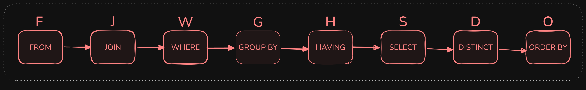
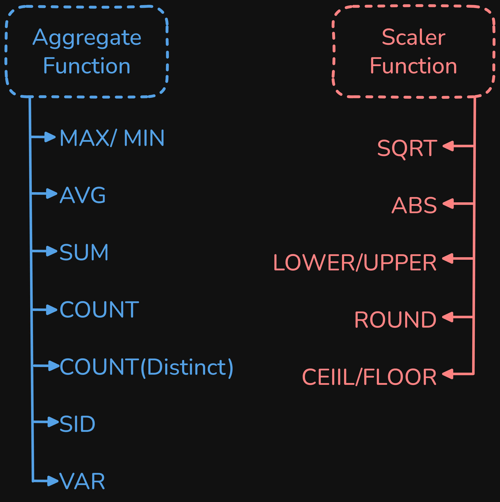

```sql
CREATE TABLE user (
    user_id INT AUTO_INCREMENT PRIMARY KEY,
    name VARCHAR(255) NOT NULL,
    email VARCHAR(255) NOT NULL,
    password VARCHAR(255) NOT NULL
);
```

## 1. Insert Command

```sql
INSERT INTO mydb.user (user_id, name, email, password)
VALUES (NULL, 'Shivam', 'shivam@gmail.com', '1234');
```

### To Insert Multiple Rows.
Using comma seperator, we can do it, 

```sql
INSERT INTO mydb.user (user_id, name, email, password)
VALUES
    (NULL, 'Shreya', 'shreya@gmail.com', '1234'),
    (NULL, 'Ravi', 'ravi@gmail.com', '5678'),
    (NULL, 'Anjali', 'anjali@gmail.com', 'abcd');
```

> **Note:** In most of the cases, we dont have to create datas (i.e. use of INSERT) but what we do most of the times is use SELECT query.

---


## Import Dataset into MySQL workbench

- Do
    - myDB >
    - tables >
    - Table Data Import Wizard >
    - File Path >
    - Provide any CSV file
    - Next >
    - Use Existing Table or New Table >
    - Give table name (if new table) >
    - Automatically Define Datatype or Also change datatype >
    - Next > 
    - Finish (After import)

### Rename Table Name

```sql
RENAME TABLE smartphones_cleaned_v6 TO smartphone;
```


---

## 1. Select only 3 columns (model, price, rating) from smartphone

```sql
SELECT model, price, rating
FROM smartphone;
```
---

## 2. Give a new name (alias) to columns in SQL.

```sql
SELECT 
    model AS phone_model, 
    price AS phone_price, 
    rating AS user_rating
FROM smartphone;
```

---


## 3. Expression inside Query

### 3.1 Calculate PPI (Pixels per Inches)

$\text{PPI} = \frac{\text{Diagonal (in pixels)}}{\text{Screen Size (in inches)}}$

Where,

$\text{Diagonal (in pixels)} = \sqrt{(\text{Resolution Width})^2 + (\text{Resolution Height})^2}$

```sql
SELECT 
    model,
    resolution_width,
    resolution_height,
    screen_size,
    SQRT(POW(resolution_width, 2) + POW(resolution_height, 2)) / screen_size AS PPI
FROM mydb.smartphone;
```

---

### 3.2 Rating given on scale of 100, give in scale of 10

```sql
SELECT 
    model,
    rating / 10 AS rating_out_of_10
FROM smartphone;
```

---

## 4. Create a column (say 'type') with all default values as 'smartphone'

```sql
SELECT 
    model,
    'smartphone' AS type
FROM smartphone;
```

> **Note:** This will not create a column in original table, but will show the column as the result. 

---

### 5. Extract all distinct brand names

```sql
SELECT 
    DISTINCT brand_name as 'All Brand'
FROM smartphone;
```

---

### 6. Multiple Distinct

```sql
SELECT 
    DISTINCT brand_name, processor_brand
FROM mydb.smartphone;

```

---

# Filtering Rows, using `WHERE` clause

## 1. Filter rows where the brand is Samsung

```sql
SELECT *
FROM smartphone
WHERE brand_name = 'Samsung';
```

---

## 2. Find all phones where the price is greater than 50,000.

```sql
SELECT *
FROM smartphone
WHERE price > 50000;
```

---

## 3. Find all phones where the brand is Samsung and RAM is greater than 8 GB

```sql
SELECT *
FROM smartphone
WHERE brand_name = 'Samsung' AND ram_capacity > 8;
```

---

# Query Execution Order



---

# `IN` and `NOT IN`

## 1. Filter smartphones where the processor is either Snapdragon, Exynos, or Bionic.

```sql
SELECT *
FROM smartphone
WHERE processor_brand = 'Snapdragon'
   OR processor_brand = 'Exynos'
   OR processor_brand = 'Bionic';
```

> **Note:** This is not a efficient way in case the number of brands increase, so we use `IN` or `NOT IN`

```sql
SELECT *
FROM smartphone
WHERE processor_brand IN ('Snapdragon', 'Exynos', 'Bionic');
```

---

# `UPDATE` & `DELETE`

## 1. We have Mediatek and Dimensity for different phones, but we know there are some with the same brand name. So, let's change Mediatek to Dimensity.

```sql
UPDATE smartphone
SET processor_brand = 'Dimensity'
WHERE processor_brand = 'Mediatek';
```

> **Note:** This is a permanent change. 

> **Note:** If this update doesn't work in workbench (Because of No Primary Key in our table). GOTO ``Edit > Preference > SEQLEDITOR > Safe Update (Uncheck) > OK``

## 2. In the user table, change the email and password for Shivam.

```sql
UPDATE mydb.user
SET email = 'mymail@example.com',
    password = 'admin'
WHERE name = 'Shivam';
```

---

## 3. Delete all phones where the price is greater than 200,000.

```sql
DELETE FROM mydb.smartphone
WHERE price > 200000;
```

> **Note:** `DELETE` & `UPDATE` are Permanent operations.

---

# Types of SQL Function


Aggregate vs Scaler Function



---

## 1. Find the maximum and minimum values in a table.

```sql
SELECT 
    MAX(price) AS max_price,
    MIN(price) AS min_price
FROM mydb.smartphone;
```
